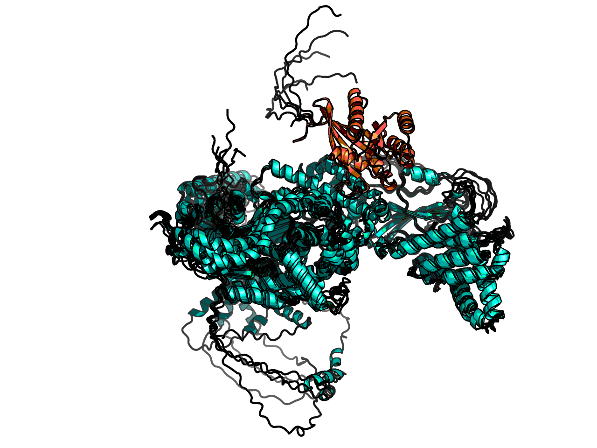

> :spy: This is a public repo of a project about to go under peer-review.
> The target name is obfuscated to prevent Search engines from indexing it. 
> If it is not Spring 2023 and you still read this, please email matteo.ferla@stats.ox.ac.uk, who will be very thankful.

A structure was not available.
The closest structure is [PDB:3CWZ](https://www.rcsb.org/structure/3CWZ), at 73% sequence identity. 
This is R6IP1 and is bond to RAB6(GTP) —both protein are GEF, but the prefered target is RAB39A.

Generating a model with ColabFold (AF2 multimer v2, 48 recycles), yielded consistent replicates, 
where the residues of interest had the following plDDT confidence (>90% is very high)

| Residue | plDDT | Domain | mutation   | complex_ddG   |
| ---- | ---- | ---- |---- | ---- |
| 237 | 90 | cDENN | P237S      | 6.2±0.2       |
| 559 | 82 | dDENN | S559L      | 0.2±1.5       |
| 749 | 79 | RUN1 | R749H      | 5.4±0.9       |
| 800 | 85 | RUN1 | S800L      | 11.3±0.7      |
| 849 | 92 | RUN1 | D849E      | 6.0±0.3       |
| 852 | 91 | RUN1 | H852Y      | -0.4±0.4      |
| 904 | 91 | PLAT | R904H      | 2.2±0.2       |

